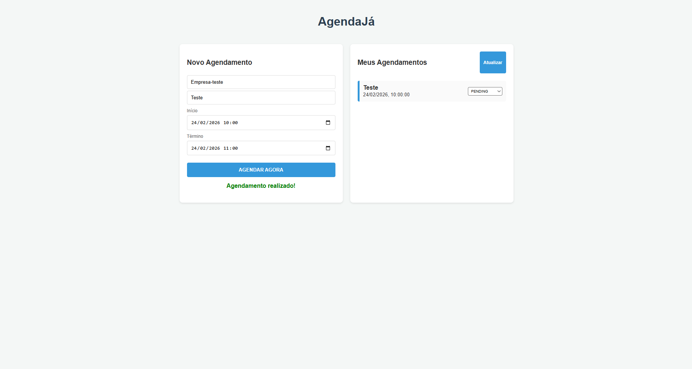
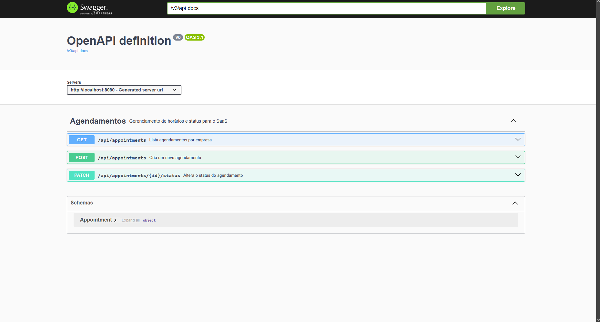
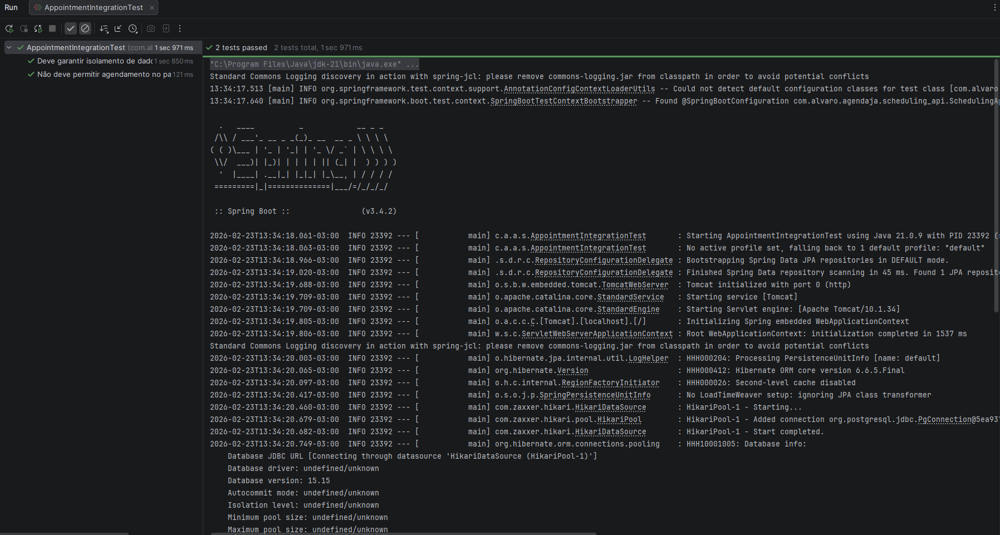

# AgendaJá - SaaS de Agendamentos Multitenant

O **AgendaJá** é uma API robusta desenvolvida em **Java 21** e **Spring Boot 3**, projetada para operar como um modelo SaaS (Software as a Service). O sistema permite que múltiplas empresas (tenants) gerenciem seus agendamentos de forma isolada e segura em uma única infraestrutura.

## 🚀 Diferenciais Técnicos

* **Arquitetura Multitenant**: Isolamento lógico de dados por `tenantId` em todas as requisições, garantindo que uma empresa nunca acesse os dados de outra.
* **Regras de Negócio Avançadas**: Validações automáticas para impedir agendamentos no passado, conflitos de horário e duração mínima de serviços.
* **Documentação Interativa**: API 100% documentada com **Swagger (OpenAPI)**, permitindo testes rápidos e visuais dos endpoints.
* **Qualidade de Software**: Suíte de testes automatizados com **JUnit 5** e **RestAssured**, validando o fluxo de sucesso e cenários de erro.
* **Infraestrutura Moderna**: Ambiente conteinerizado com **Docker** para o banco de dados PostgreSQL, garantindo portabilidade.

## 📸 Demonstração Visual

### Interface do Usuário (Frontend)
Dashboard minimalista desenvolvido para validar as operações de agendamento e o ciclo de vida dos estados em tempo real.


### Documentação Interativa (Swagger)
A API segue os padrões OpenAPI 3.0, garantindo uma documentação clara e fácil integração.


## 🛠️ Tecnologias Utilizadas

* **Backend**: Java 21, Spring Boot 3, Spring Data JPA, Lombok.
* **Banco de Dados**: PostgreSQL 15 rodando via Docker.
* **Testes**: JUnit 5, RestAssured.
* **Documentação**: SpringDoc OpenAPI (Swagger).
* **Frontend**: HTML5 e JavaScript puro (Vanilla JS).

## 📋 Como Executar o Projeto

### 1. Requisitos
* Java 21+
* Docker e Docker Compose
* Maven

### 2. Configurando o Banco de Dados
Na raiz do projeto (ou na pasta `/docker`), execute o comando para subir o PostgreSQL:
```bash
docker-compose up -d
```

### 3. Executando a API
``` bash
mvn spring-boot:run
```

### 4. Acessando a Documentação
Com a aplicação rodando, acesse: http://localhost:8080/swagger-ui.html

### 🧪 Qualidade de Software e Testes Automatizados
Para garantir a integridade das regras de negócio e o isolamento multitenant, o projeto conta com uma suíte de testes de integração utilizando JUnit 5 e RestAssured. Estes testes validam desde a criação de agendamentos até as travas de segurança entre diferentes empresas.
